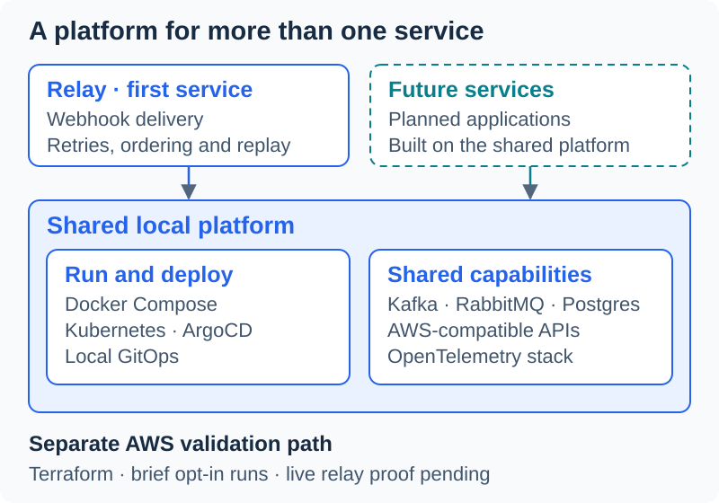
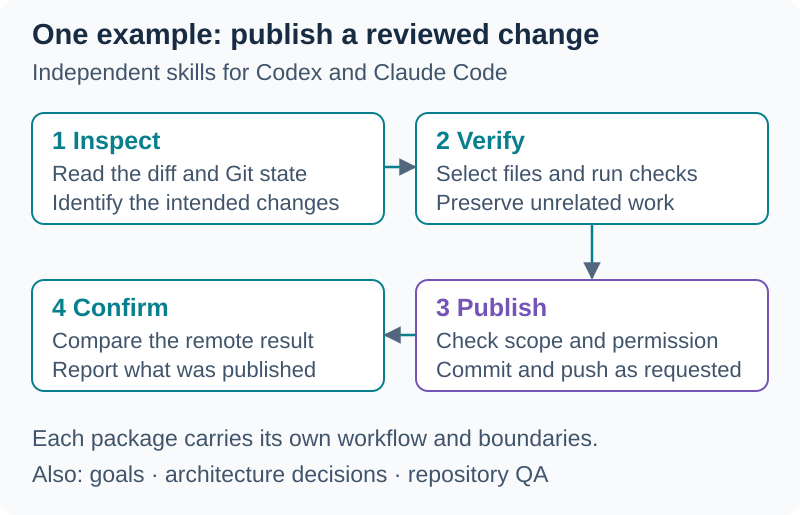

# Lila Brooks

**Engineering leadership · Cloud & platform engineering · Applied AI**

[AWS Public Change Alerting](#aws-public-change-alerting) · [my-local-platform](#my-local-platform) · [Personal Agent Skills](#personal-agent-skills) · [BreedFrame](#breedframe)

## About

I lead engineering teams and build cloud platforms, distributed services, and
developer tools. My public projects span AWS infrastructure, reusable agent
workflows, and experiments with local AI and vision models.

## Featured projects

### [AWS Public Change Alerting](https://github.com/lilabrooks/aws-public-change-feed)

Public AWS announcements are matched against configured services and risk
phrases, mapped to Slack routes, stored in DynamoDB, and delivered through SQS.

[**▶ Watch the walkthrough**](https://lilabrooks.github.io/aws-public-change-feed/#mvp-demo) · [Architecture](https://lilabrooks.github.io/aws-public-change-feed/#flow) · [Repository](https://github.com/lilabrooks/aws-public-change-feed)

### [my-local-platform](https://github.com/lilabrooks/my-local-platform)

A local development platform for building and testing distributed services with
Docker Compose, Kubernetes, messaging, databases, and observability. Relay, a
webhook delivery service, is its first application, with more services planned.
A separate Terraform workflow supports brief AWS validation runs.

*Local development comes first. The live EKS, RDS, and MSK relay proof is pending.*

[**Explore the platform**](https://github.com/lilabrooks/my-local-platform#what-runs-here) · [Relay service](https://github.com/lilabrooks/my-local-platform#relay) · [Repository](https://github.com/lilabrooks/my-local-platform)

### [Personal Agent Skills](https://github.com/lilabrooks/lila-agent-skills)

Reusable workflows for Codex and Claude Code, covering project planning,
architecture decisions, repository checks, and Git publishing. Each skill
packages instructions and supporting tools with explicit verification and
permission boundaries.

[**Browse the skill catalog**](https://lilabrooks.github.io/lila-agent-skills/) · [Example workflow](https://github.com/lilabrooks/lila-agent-skills/tree/main/skills/github-publish-changes) · [Repository](https://github.com/lilabrooks/lila-agent-skills)

### [BreedFrame](https://github.com/lilabrooks/breedframe)

A local dog-photo investigation prototype experimenting with local vision
models and agent-directed tool use. Scout uses Qwen3 to choose investigation
steps, while a separate vision model ranks visual breed matches and records
evidence for the assessment.

*Scout running a local vision model during a real demo investigation.*

[Screenshot and photo credits](https://github.com/lilabrooks/breedframe/blob/main/docs/screenshots/README.md#photo-attribution-and-license) · Beagle photo by [sannse](https://commons.wikimedia.org/wiki/File:Beagle_600.jpg) · [CC BY-SA 3.0](https://creativecommons.org/licenses/by-sa/3.0/)

*Completed prototype; model experiments closed. Findings document the reporting limits.*

[**Explore the architecture**](https://github.com/lilabrooks/breedframe#architecture) · [Findings and limits](https://github.com/lilabrooks/breedframe/blob/main/docs/findings.md) · [Repository](https://github.com/lilabrooks/breedframe)

#### How it works

<strong>View BreedFrame's architecture diagram</strong>

[**Open the full-size diagram**](https://github.com/lilabrooks/breedframe/blob/main/docs/diagrams/breedframe-architecture.svg) · [AI and ML inference detail](https://github.com/lilabrooks/breedframe/blob/main/docs/diagrams/breedframe-inference.svg)

## Other work

- [**CliSpecForge**](https://github.com/lilabrooks/clispecforge): a compact Python reference implementation that turns a Markdown CLI spec into files that can be inspected before guarded writes.
- [**Compact Theme**](https://github.com/lilabrooks/compact-theme): a framework-free HTML, CSS, and JavaScript theme used across my GitHub Pages sites.

## Engineering focus

- **Platforms and distributed services:** building a shared local platform for
  multiple applications, with clear service boundaries, observability, and
  controlled AWS validation.
- **Agent-assisted development:** creating reusable workflows for planning,
  architecture decisions, repository checks, and publishing, with explicit
  permissions and changes checked against specifications and tests.
- **Local AI and vision models:** exploring model behavior through small
  applications, visible tool execution, and measured results that document
  usefulness and limitations.

Earlier experiments

[Claude OKF repo kit](https://github.com/lilabrooks/claude-okf-repo-kit) is
archived. Its useful repository-governance ideas now inform the smaller tools
and skills above. [spec-drift](https://github.com/lilabrooks/spec-drift) is also
being retired after its experiment concluded.

